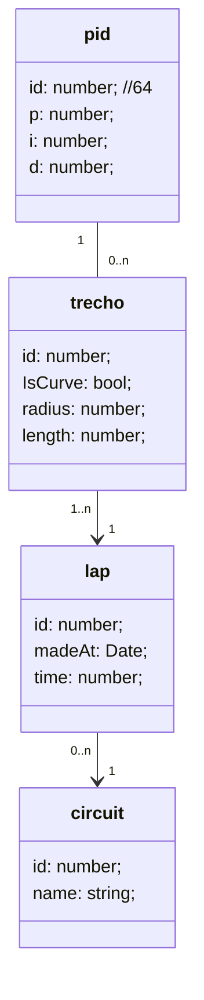

```mermaid
classDiagram

class pid{
    id: number; //64
    p: number;
    i: number;
    d: number;
}

pid "1" -- "0..n" trecho

class trecho{
    id: number;
    IsCurve: bool;
    radius: number;
    length: number;
}

trecho "1..n" --> "1" lap

class lap{
    id: number;
    madeAt: Date;
    time: number;
}

lap "0..n" --> "1" circuit

class circuit{
    id: number;
    name: string;
}

```